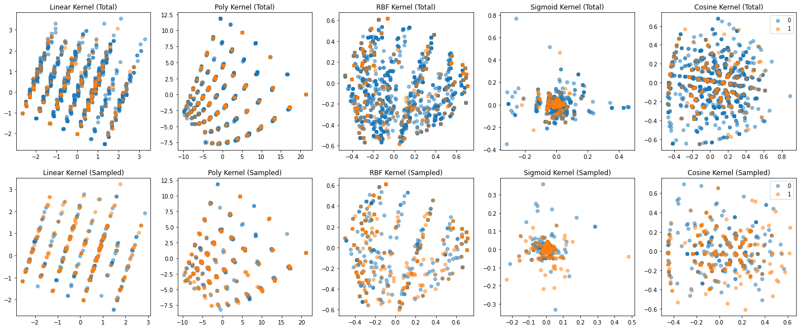

# Supplementary materials to COMS30050: Applied Datascience

## Disrtibution of targets

    

<!--  -->
*Distribution of targets. Data distribution of targets except for NaN values.*

## Correlation Matrix and *p*-value: Additional Results

| what is going on | sdf |
| - | - |
| sdf | ds |
|  | 

*Correlation matrix between screen time variables and mental health variables with sampled data-set. **Left**: The darker the cell, the more the correlation between two variables. **Right**: The lighter the cell, the more the significance of the corresponding correlation value.*

## PCA with Kernels: Additional Results

### `dep_thoughts`

*Top: Total data. Bottom: Sampled data. This figure shows the relationship between Xs and Y (`dep_thoughts`). 0: no depression and 1: depression.*

### `has_dep_daig`

*Top: Total data. Bottom: Sampled data. This figure shows the relationship between Xs and Y (`has_dep_diag`). 0: no depression and 1: depression.*

### `prim_diag`

*Top: Total data. Bottom: Sampled data. This figure shows the relationship between Xs and Y (`prim_diag`). 0: no depression and 1: depression.*

### `secd_diag`

*Top: Total data. Bottom: Sampled data. This figure shows the relationship between Xs and Y (`secd_score`). 0: no depression and 1: depression.*

### `panic_score`

*Top: Total data. Bottom: Sampled data. This figure shows the relationship between Xs and Y (`panic_score`). 0: no depression and 1: depression.*

## t-SNE: Additional Results

    

<!--  -->

*Results after performing t-SNE on **X**s and each **y** on the total version of the data-set.*

    

*Results after performing t-SNE on **X**s and each **y** on the sampled version of the data-set.*
<!--  -->

## Data Modeling: Hyper-parameter search

| Hyper-parameters | Search boundary |
| - | - |
| `gamma` | `[int(x) for x in np.logspace(-4, -1, 4)]` |
| `C` | `[int(x) for x in np.logspace(-3, 1, 5)]` |
| `kernel` | `['linear', 'poly', 'rbf', 'sigmoid']` |

*A hyper-parameter search for SVM*

| Hyper-parameters | Search boundary |
| - | - |
| `C` | `[int(x) for x in np.logspace(-4, 2, 7)]` |
| `solver` | `['newton-cg', 'lbfgs', 'liblinear', 'sag', 'saga']` |
| `penalty` | `['l1', 'l2', 'elasticnet', 'none']` |
| `multi_class` | `['auto', 'ovr', 'multinomial']` |

*A hyper-parameter search for Logistic Regression*

| Hyper-parameters | Search boundary |
| - | - |
| `weights` | `['uniform', 'distance']` |
| `algorithm` | `['auto', 'ball_tree', 'kd_tree', 'brute']` |
| `leaf_size` | `np.linspace(2, 100, 10, dtype=int)` |
| `n_neighbours` | `[int(x) for x in np.linspace(2, 50, 10)]` |

*A hyper-parameter search for KNN*

| Hyper-parameters | Search boundary |
| - | - |
| `n_estimators` | `[int(x) for x in np.linspace(5, 50, 5)` |
| `criterion` | `[Gini, Entropy]` |
| `max_depth` | `[int(x) for x in np.linspace(2, 50, 5)]` |
| `min_samples_split` | `[int(x) for x in np.linspace(2, 50, 5)]` |
| `min_samples_leaf` | `[int(x) for x in np.linspace(2, 50, 5)]` |
| `max_features` | `['auto', 'sqrt', 'log2']` |
| `bootstrap` | `[True, False]` |

*A hyper-parameter search for Random Forest*

## Additional work

 

*Result of running RF on under-sampled on `text_week` and `text_wend`*
